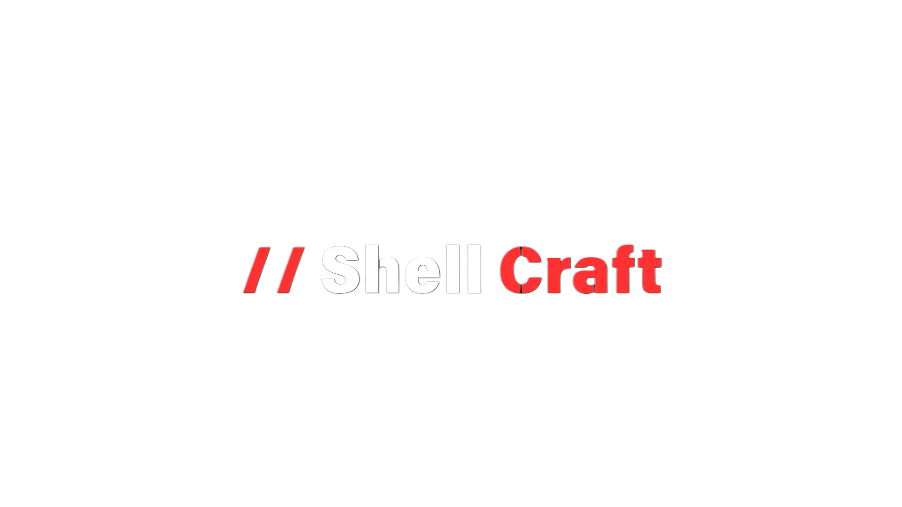

# ShellCraft


[](https://github.com/HackScaleTeam/ShellCraft/issues)
[](https://twitter.com/_hackscale_)
[](https://twitter.com/sam_X86_)
[](https://www.youtube.com/channel/UCGY_Cnhao2lebIIYYb2jovA)
[](https://python.org)
[](https://metasploit.com)
[](LICENSE)


Shellcraft is a modular Windows payload construction framework designed for red team operations and offensive security research.

It focuses on shellcode-driven execution, compiling native Windows binaries using reproducible C/C++ templates and static toolchains.
> [!IMPORTANT]
> ## DISCLAIMER & RESPONSIBLE USE
>
> This repository is provided strictly for **educational, academic, and defensive security research purposes**.
>
> This project **does NOT provide ready-to-use malware**, and it is **NOT intended for unauthorized access, exploitation, or deployment on real systems**.
>
> Any execution, testing, or experimentation **must be performed only in isolated lab environments** on systems you own or are explicitly authorized to test.
>
> The author does **not encourage, support, or condone malicious activity**, and assumes **no responsibility** for misuse, damage, or legal consequences arising from improper use.
>
> By accessing or using this repository, you acknowledge full responsibility for complying with all applicable laws, regulations, and ethical guidelines.
---

## Overview

Shellcraft automates the process of:

- Consuming raw shellcode (msfvenom or external)
- Injecting shellcode into native Windows payloads
- Building a dropper + DLL execution chain
- Producing statically linked Windows binaries

The project is intended to be auditable, hackable, and extensible, rather than a black-box payload generator.

---

## Design Goals

- Deterministic builds
- Template-driven payloads
- Minimal runtime dependencies
- Explicit execution flow
- Research-first, not “AV-bypass-first”

---

## Architecture
```bash
shellcraft/
├── shellcraft.py # Entry point
├── sources/
│ ├── payload_dll.cpp # Shellcode loader (DLL)
│ ├── dropper.cpp # Dropper executable
│ └── DefenderWrite.cpp # Helper binary
```

## Execution flow

1. Shellcode is generated or loaded from disk
2. Shellcode is embedded into payload_dll.cpp
3. Payload DLL is compiled
4. Dropper EXE is compiled
5. Dropper stages execution on target

---
## Installation

ShellCraft is designed to run on Linux systems and requires a minimal, reproducible toolchain.

### 1. Clone the repository
```bash
git clone https://github.com/HackScaleTeam/ShellCraft.git
cd ShellCraft
```
### 2. Install dependencies

ShellCraft provides a bootstrap installer that installs all required build dependencies.
```bash
chmod +x install.sh
sudo ./install.sh
```

### The installer will:

 - Detect your Linux distribution

 - Install Python 3

 - Install MinGW-w64 (Windows cross-compiler)

 - Install Metasploit Framework (optional, for msfvenom)

### 3. Verify installation

After installation, ensure the required tools are available:
```bash 
python3 --version
msfvenom --version
x86_64-w64-mingw32-g++ --version
```

### 4. Run ShellCraft
```bash
python3 shellcraft.py --help
```

### Notes

Metasploit Framework is optional and only required when using the --msf shellcode generation mode.

All builds are performed on Linux and produce native Windows binaries.

Generated artifacts must reside in the same directory at runtime.

### Supported Platforms

 Linux (Debian / Ubuntu / Kali)

 Linux (Arch-based)

 Linux (Fedora / RHEL-based)

**Windows and macOS are not supported.**


## Shellcode Sources

Shellcraft supports two input methods:

### msfvenom
```bash
shellcraft --msf <LHOST> <LPORT> -o payload.exe
```

### Raw shellcode file
```bash

shellcraft -s shellcode.bin -o payload.exe
```
Shellcode is treated as opaque input.

No encoding, encryption, or mutation is applied by default.


### Toolchain
Metasploit Framework (optional)

MinGW-w64 (x86_64-w64-mingw32-g++)

### Output

```bash

payload.exe          # Dropper
payload.dll          # Shellcode DLL
DefenderWrite.exe    # Helper binary
```
All artifacts are designed to reside in the same directory at runtime.

## Limitations

No evasion or obfuscation layer

No in-memory-only execution

No automatic privilege escalation

Detection by modern EDRs is expected

Shellcraft is a framework, not a finished weapon.

## Use Case
Red team tradecraft experimentation

Payload development research

Windows execution-chain prototyping

Template-based payload engineering

### Supporters
[](https://github.com/HackScaleTeam/ShellCraft/stargazers)

[](https://github.com/HackScaleTeam/ShellCraft/network/members)


## Legal
This project is provided for authorized security testing and research only.

You are responsible for compliance with all applicable laws and engagement scopes.
